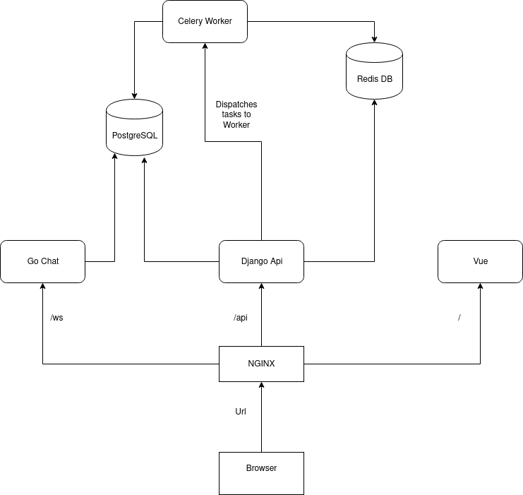

## Contributing

#### Thanks
First of all, thank you for wanting to contribute. If you have any questions or problems, please
get in touch with me and I will do my best to help you. I appreciate any support I am getting.


#### Official docs
Please also see the [official docs](https://docs.thesharegame.com/).


#### Overview



#### Pre requirements
The following services must be installed on your computer:

- python3 & pip3
- golang
- npm
- postgresql
- redis (optional)


#### Start Services

In order to start all the services locally you have to run the following commands:
To install everything run:
```bash
> make deps
```

This script installs all the necessary dependencies

- such as packages for the python backend
- go modules for the chat
- npm packages for the frontend.

Furthermore, it creates a python virtual environment.


##### Backend
```bash
> cd backend/
> make runserver
```


##### Backend Chat
```bash
> cd backend/chat
> make runserver
```


##### Frontend
```bash
> make runserver
```

Now you should be able to access the web interface on http://localhost:8080

Most features should work now. Features which require a separate worker such as periodic tasks - key figures' calculation, bond payout, order matching etc. - would require to also start celery so the backend processes can run.


##### Celery Worker
```bash
> cd backend/
> make celery-worker
```


##### Celery Beat
```bash
> cd backend/
> make celery-beat
```


#### Testing

If you have finished your implementation you can run all tests by executing the following command from the root of the project
```bash
> make test
```

The tests suite consists of unit testing & linting tests for the backend and frontend.


#### Format all files
If you want to format all files in the project run from the root:
```bash
> make fmt
```

If you just want to format the django backend, run:
```bash
> cd backend
> make fmt
```


#### Docker
If you want to test the deployment just run from the root of the project:
```bash
> make build && make up
```

This runs docker-compose and builds the related containers.


#### Workflow example
I use [tmux](https://github.com/tmux/tmux) for developing. Effectively, I open 3 panels.
One for backend, frontend and the chat. In everyone of those panels I run:
```bash
> make runserver
```


